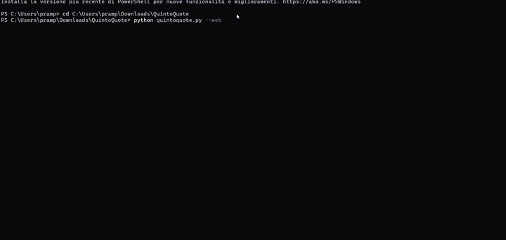
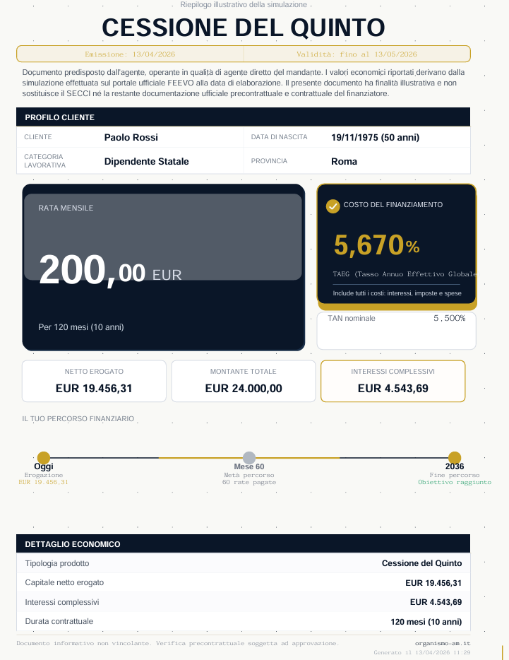
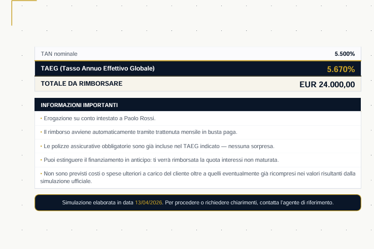
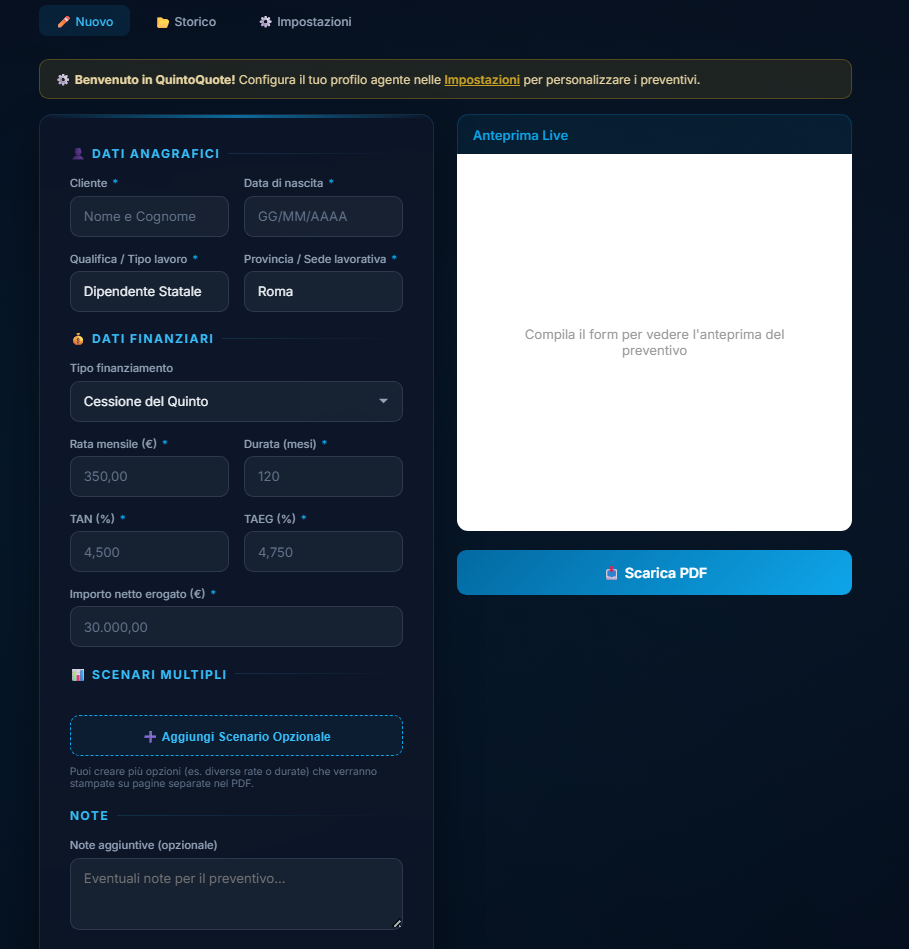
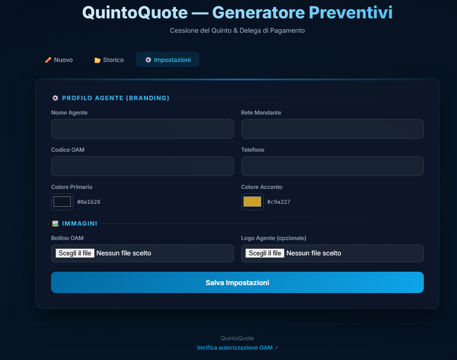
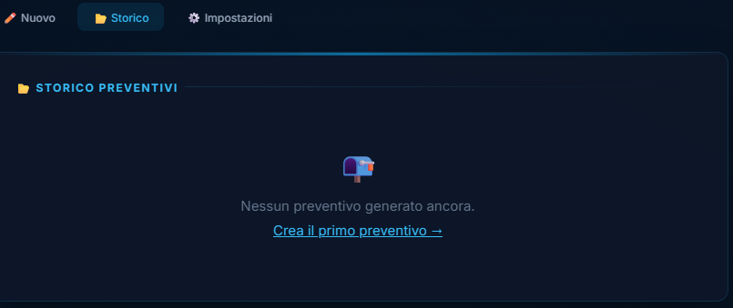

<p align="center">
  <strong style="font-size:2em">QuintoQuote</strong>
</p>

<p align="center">
  Generatore open source di preventivi PDF professionali<br>
  per <strong>Cessione del Quinto</strong> e <strong>Delega di Pagamento</strong>.
</p>

<p align="center">
  <strong>Locale. Veloce. Personalizzabile. Pronto da inviare al cliente.</strong>
</p>

<p align="center">
  
  
  
  
</p>

<p align="center">
  Web UI locale &nbsp;&middot;&nbsp; CLI &nbsp;&middot;&nbsp; Branding agente &nbsp;&middot;&nbsp; Bollino OAM cliccabile &nbsp;&middot;&nbsp; Multi-scenario
</p>

<p align="center">
  
</p>

> *QuintoQuote e un progetto open source pensato per aiutare agenti, collaboratori e realta non strutturate a preparare preventivi PDF chiari, ordinati e professionali. E uno strumento di supporto operativo e non sostituisce mai la documentazione bancaria ufficiale, precontrattuale o contrattuale, ne le verifiche, le delibere o le condizioni definitive del soggetto finanziatore.*

---

## Provalo in 30 secondi

```bash
pip install -e .
QuintoQuote start
```

Si apre il browser. Compili il form. Scarichi il PDF. Fine.

---

## Il risultato

| Pagina 1 | Pagina 2 |
| --- | --- |
|  |  |

Questo e il tipo di PDF che puoi inviare subito al cliente: chiaro, elegante, brandizzato e pronto all'uso. Hero card rata/TAEG, timeline finanziaria, tabella economica dettagliata, bollino OAM cliccabile. Tutto con i tuoi colori e il tuo nome.

---

## La web UI



Anteprima live a destra, form a sinistra. Ogni campo che modifichi aggiorna l'anteprima in tempo reale. Quando sei soddisfatto, scarichi il PDF.

---

## Perche QuintoQuote

- **Gira in locale sul tuo PC.** Nessun server, nessun cloud, nessun dato che esce.
- **Nessun SaaS, nessun abbonamento.** Installi e usi. Per sempre.
- **PDF professionali gia pronti.** Non servono template, non serve Canva, non serve Word.
- **Branding agente completo.** Nome, rete, OAM, colori, logo, bollino: tutto tuo.
- **Bollino OAM cliccabile.** Chi riceve il PDF clicca e verifica la tua iscrizione.
- **Multi-scenario.** Piu opzioni nello stesso PDF, una pagina per scenario.
- **Adatto a uso reale.** Non e una demo. E quello che usi ogni giorno.

---

## Per chi e

- Agenti in attivita finanziaria
- Collaboratori OAM
- Mediatori creditizi
- Reti vendita e strutture commerciali
- Professionisti che vogliono generare preventivi in locale, senza SaaS

---

## Cosa fa, in pratica

| Funzione | Dettaglio |
| --- | --- |
| PDF premium | Hero card rata/TAEG, KPI, timeline, tabella, note legali |
| Anteprima live | Il preventivo si aggiorna mentre compili il form |
| Editing inline | Modifica disclaimer, note e closing direttamente nell'anteprima |
| Branding agente | Nome, rete mandante, codice OAM, telefono, colori primario/accento |
| Bollino OAM | JPG/PNG caricato dalle Impostazioni, cliccabile nel PDF |
| Logo agente | Opzionale, visibile nell'header del PDF |
| Multi-scenario | Piu combinazioni rata/durata nello stesso documento |
| Storico PDF | Tutti i preventivi generati, scaricabili dalla UI |
| CLI guidata | Prompt interattivo da terminale |
| CLI batch | `--non-interactive` per script e automazioni |

---

## Configurazione agente



1. Avvia QuintoQuote
2. Vai in **Impostazioni**
3. Compila nome, rete, OAM, telefono
4. Scegli i colori
5. Carica bollino OAM e logo
6. Salva

Da quel momento ogni PDF che generi porta il tuo branding.

---

## Storico



Tutti i PDF generati restano disponibili per il download.

---

## Installazione

### Requisiti

- Python 3.10+
- `reportlab`
- `flask`

### Setup

```bash
pip install -e .
```

Dopo l'installazione hai il comando `QuintoQuote` disponibile ovunque.

### Avvio

```bash
QuintoQuote start
```

Apre la web UI e prova ad aprire il browser automaticamente.
Se serve, vai a mano su [http://127.0.0.1:5000](http://127.0.0.1:5000).

### Avvio su porta diversa

```bash
QuintoQuote start --port 5010
```

### Fallback senza installazione

```bash
python quintoquote.py start
```

---

## Uso da CLI

CLI guidata:

```bash
python quintoquote.py
```

CLI non interattiva:

```bash
python quintoquote.py --non-interactive \
  --cliente "Mario Rossi" \
  --data-nascita "15/05/1975" \
  --tipo-lavoro "Dipendente Statale" \
  --provincia "Milano" \
  --tipo-finanziamento "Cessione del Quinto" \
  --importo-rata 350 \
  --durata-mesi 120 \
  --tan 4.5 \
  --taeg 4.75 \
  --importo-erogato 30000
```

Multi-scenario:

```bash
python quintoquote.py --non-interactive \
  --cliente "Mario Rossi" \
  --data-nascita "15/05/1975" \
  --tipo-lavoro "Dipendente Statale" \
  --provincia "Milano" \
  --importo-rata 350 --durata-mesi 120 --tan 4.5 --taeg 4.75 --importo-erogato 30000 \
  --scenario "300;96;4.2;4.5;25000" \
  --scenario "400;120;4.8;5.1;35000"
```

Formato scenario: `rata;durata_mesi;tan;taeg;importo_erogato[;tipo_finanziamento]`

---

## Roadmap

- [ ] Refactor in moduli separati
- [ ] Template PDF aggiuntivi
- [ ] Export scenari comparativo
- [ ] Configurazioni branding avanzate
- [ ] Packaging per distribuzione standalone

---

## Note legali

QuintoQuote e un progetto open source pensato per aiutare agenti, collaboratori e realta non strutturate a preparare preventivi PDF chiari, ordinati e professionali. E uno strumento di supporto operativo e non sostituisce mai la documentazione bancaria ufficiale, precontrattuale o contrattuale, ne le verifiche, le delibere o le condizioni definitive del soggetto finanziatore. I valori economici riportati nei PDF generati hanno finalita esclusivamente illustrativa e devono essere verificati sul portale ufficiale dell'istituto mandante prima di qualsiasi utilizzo commerciale.

## Licenza

MIT
